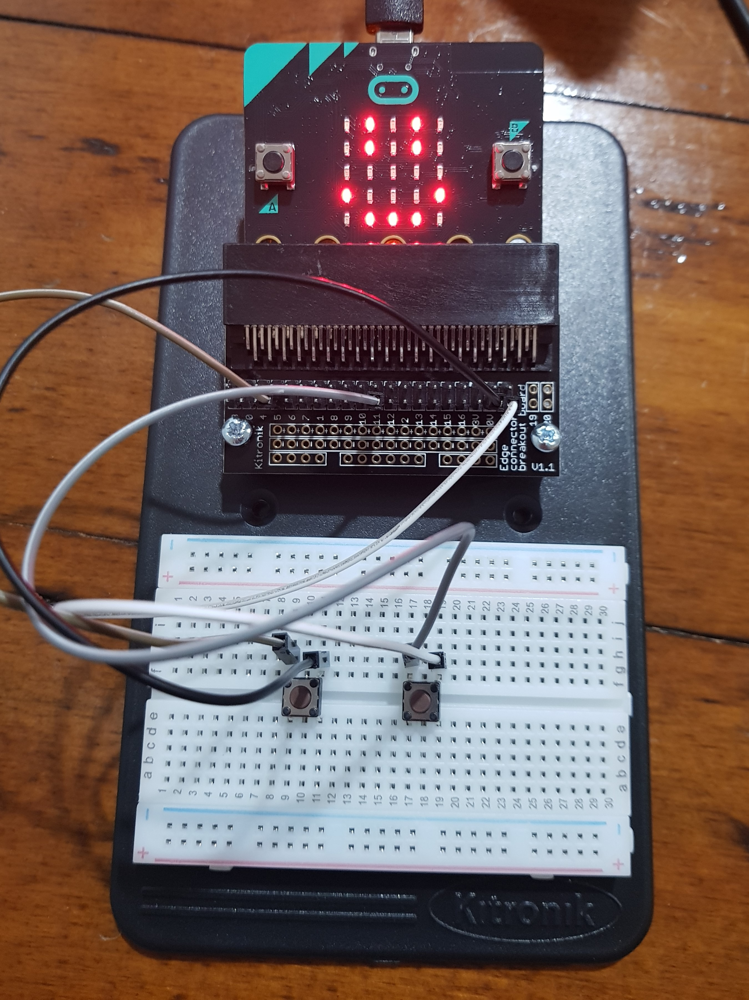
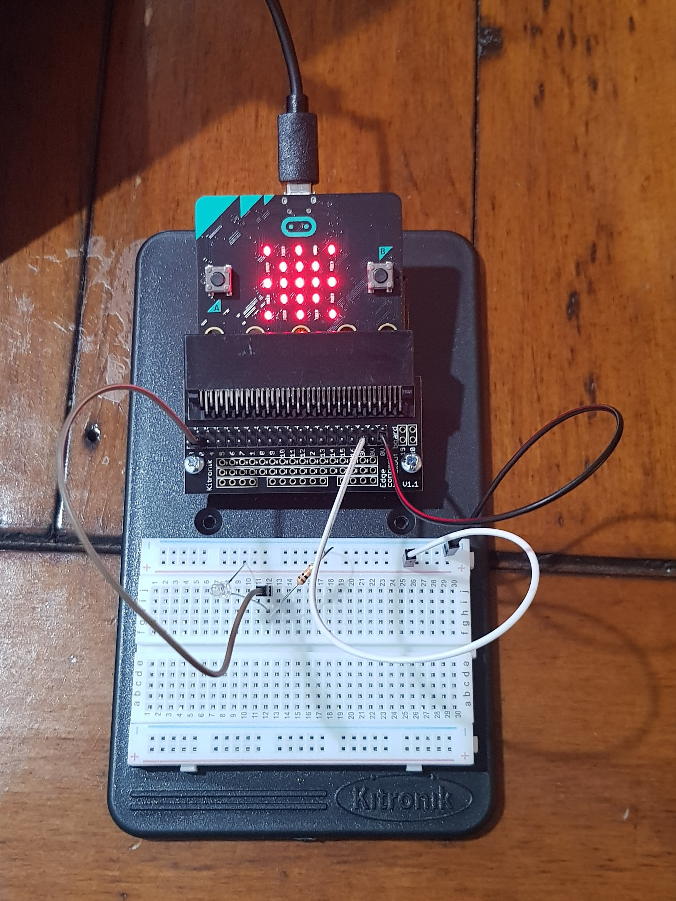
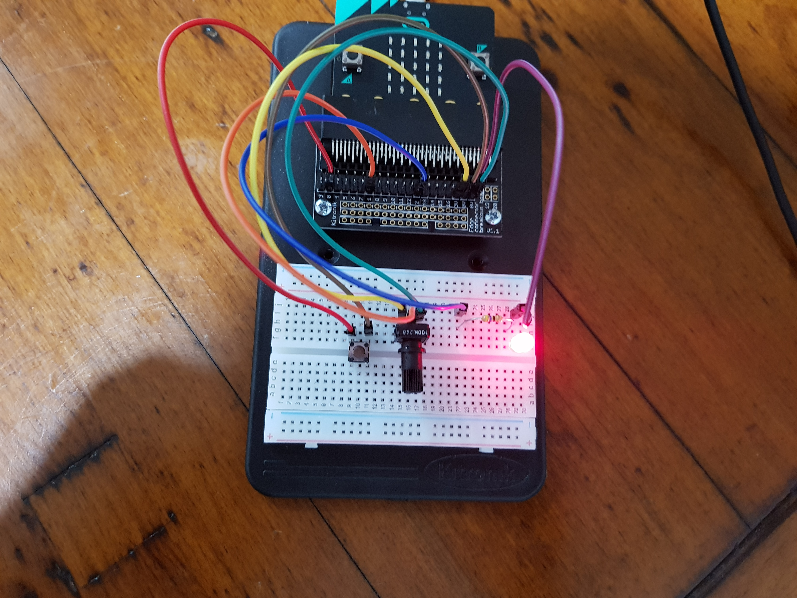
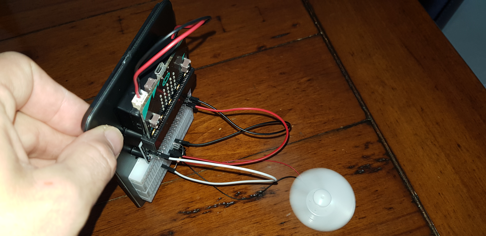

# Inventor Kit Experiments#

### Exp 1: Say Hello to micro:bit ###

#### Photo of experiment 1 displaying the smiley face icon ####

[Here is the experiment in action](https://github.com/kaeleiby/1701QCA-Assessment1/blob/master/experiments/exp1.mp4)

#### Reflection ####
In this experiment, something new to me was or something I learned was using the breadboard for creating temporary circuits.

This experiment could be the basis of a real world application where led devices display scrolling information or crawls such as airports, cinema theatres, billboards, etc.

### Exp 2: Using a Light sensor & Analog Inputs ###

#### Photo of experiment 2 displaying the 'Sun' icon ####

[Here is the experiment in action](https://github.com/kaeleiby/1701QCA-Assessment1/blob/master/experiments/exp2.mp4)

#### Reflection ####
In this experiment, something new to me was or something I learned was using resistors and researching the colour coding. I also had never used an analog/digital converter to create values in a  coding variable. 

This experiment could be the basis of a real world application such as automated street lights.

### Exp 3: Dimming an LED using a Potentiometer ###

#### Photo of experiment 3 displaying at full brightness ####

[Here is the experiment in action](https://github.com/kaeleiby/1701QCA-Assessment1/blob/master/experiments/exp3.mp4)

#### Reflection ####
In this experiment, something new to me was or something I learned was utilising a potentiometer.

This experiment could be the basis of a real world application such as a husehold dimmer switch.

### Exp 4: Using a Transistor to Drive a Motor ###

#### Photo of Experiment 4 ready to turn the fan ####

[Here is the experiment in action](https://github.com/kaeleiby/1701QCA-Assessment1/blob/master/experiments/exp4.mp4)

#### Reflection ####
In this experiment, something new to me was or something I learned was using the transistor and its role in regulating the flow of electricity.

This experiment could be the basis of a real world application such as air cinditioning units that regulate and control atmospheric conditions in a controlled environment.

### Exp 5: Using the Accelerometer to Control Motor Speed ###

#### Photo of Experiment 5 running at full speed ####

[Here is the experiment in action](https://github.com/kaeleiby/1701QCA-Assessment1/blob/master/experiments/exp5.mp4)

#### Reflection ####
In this experiment, something new to me was or something I learned was utilising an accelerometer to output a value to a variable while coding.

This experiment could be the basis of a real world application like how a smart watch uses gesturing to turn on the watch face when titled.

