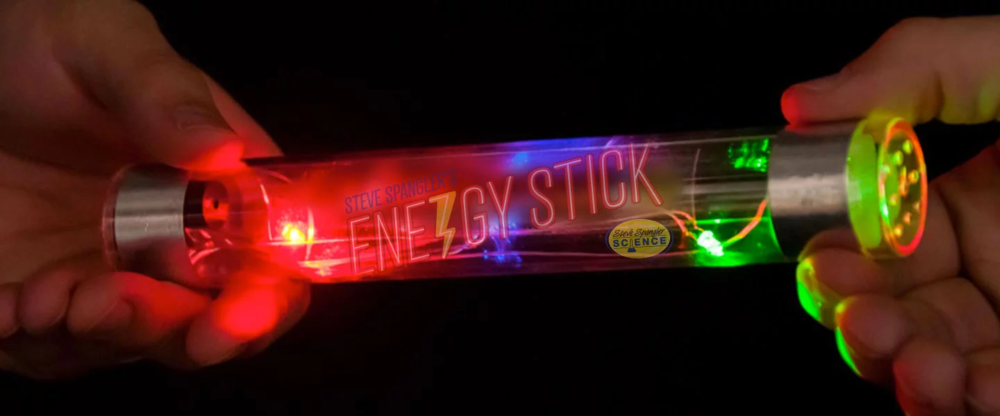
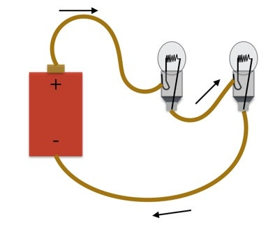
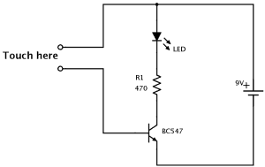
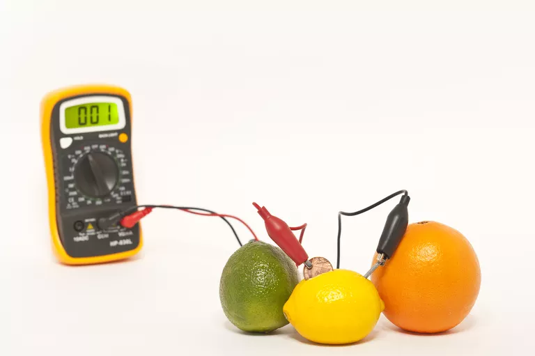

# Assessment 1: Replication project

## Replication project: Banana Keyboard ##

https://makecode.microbit.org/projects/banana-keyboard/make

## Related projects ##

### Related project 1 ###
The Original Heng Balance Lamp

https://www.theoriginalmoonlamp.com/products/the-original-heng-balance-lamp

This project is related to mine because it uses a nonconventional way to close the electronic circuit and switch on the light using magnets.

### Related project 2 ###
Electric Keyboard

https://au.yamaha.com/en/products/musical_instruments/keyboards/index.html

This project is related to mine because it creates sounds via electic currents.

### Related project 3 ###
Enregy Stick

https://www.stevespanglerscience.com/lab/experiments/human-circuit/

This project is related to mine because it uses a human to bridge the circuit and power on.

### Related project 4 ###
Christmas/Fairy Lights wired in a Series Circuit

https://www.wired.com/2014/12/christmas-lights-series-parallel/

This project is related to mine as older styles of decorative lights used to be wired in a series. If one light bulb malfunctioned, the circuit would be broken. Newer decorative lights use parallel wiring, so if a bulb breaks, the circuit remains complete.

### Related project 5 ###
Touch Sensor

https://www.build-electronic-circuits.com/how-to-make-a-simple-touch-sensor/

This project is related to mine because it requires human contact to coplete the circuit.

### Related project 6 ###
Fruit Battery

https://www.thoughtco.com/how-to-make-a-fruit-battery-605970

This project is related to mine because it utilises organic material in an electrical circuit. It goes a step further and uses the organic materials to create a charge, rather than using an external power source.

## Reading reflections ##

### Reading: Don Norman, The Design of Everyday Things, Chapter 1 (The Psychopathology of Everyday Things) ###

I was surprised to learn that identifying affordances in objects can also create unintentional affordances (ie: the bookmark - used a placeholder, but unintentionally shows how much of the book remains).

I have always been able to identify a design flaw by a lack of signifiers, but was unable to articulate what I was trying to say. Just learning the terminology has made explanations relating to problems I have uncovered easier to collaborate with others and brainstorm a solution.

I am interested to discover more ordinary items or objects I use, where the designer expects the user to instinctively understand how they work, without providing any signifiers or instructions.

I need to remember to provide simple instructions for users of my designs, especially if it is unclear or unintuitive as to how something operates.

### Reading: Chapter 1 of Dan Saffer, Microinteractions: Designing with Details, Chapter 1 ###

Before reading this chapter, I hadn't even considered how some of our more intuiative features and functions in commonplace applications and programs were only established as defaults after many iterations or design attempts.

I realised that I tend to instinctively ask questions relating to microinteractions. I have always tested features in a new device (ie: whether or not silencing my smartphone at night will still activate an alarm) and realised that user feedback for microinteractions is something I apply to my own designs without conscious thought. 

I'm would like to investigate what trends of microinteractions are currently exciting and opening debates in the user interface and design community, and see if there are some solutions I may be able to problem solve.

One interesting microinteraction I encountered with my replication project was investigating what would happen when both circuit gaps were bridged simultaneously. Which part of my code would take precedence?

### Reading: Scott Sullivan, Prototyping Interactive Objects ###

I began reading Scott's recount of his Capybara project thinking he had a solid background in programming and coding, and would take on such a project with all the knowledge necessary to succeed. I was challenged when he described his failures and frustrations, as he had to learn and navigate his way towards his end goal.

I was surprised to read that his feeling of accomplishment mirrors mine when I tackle a task I previously believed to be beyond my scope of practice. He also explained how excited it would make him, even when that finished product seemed insignificant to others or loved ones. I find myself relating to Scott, as I relish in a personal victory, no matter how small.

I would like to further explore how exactly the storeowner identified issus with the store layout. I'm interested in how he was able to see something obvious that went over everyone else's head.

I found this reading encouraging and promising when I compare it to my own experiences with construction of projects. I often run into an idea without having the knowledge to feasibly create or design what I want it to do. Scott's reading showed me that learning new skills are in fact part of the prototyping process.

## Interaction flowchart ##
*Draw a flowchart of the interaction process in your project. Make sure you think about all the stages of interaction step-by-step. Also make sure that you consider actions a user might take that aren't what you intend in an ideal use case. Insert an image of it below. It might just be a photo of a hand-drawn sketch, not a carefully drawn digital diagram. It just needs to be legible.*

## Process documentation

*In this section, include text and images that represent the development of your project including sources you've found (URLs and written references), choices you've made, sketches you've done, iterations completed, materials you've investigated, and code samples. Use the markdown reference for help in formatting the material.*

*This should have quite a lot of information!*

*There will likely by a dozen or so images of the project under construction. The images should help explain why you've made the choices you've made as well as what you have done. Use the code below to include images, and copy it for each image, updating the information for each.*

*Include screenshots of the code you have used.*

## Project outcome ##

*Complete the following information.*

### Project title ###

### Project description ###

*In a few sentences, describe what the project is and does, who it is for, and a typical use case.*

### Showcase image ###

*Try to capture the image as if it were in a portfolio, sales material, or project proposal. The project isn't likely to be something that finished, but practice making images that capture the project in that style.*

### Additional view ###

*Provide some other image that gives a viewer a different perspective on the project such as more about how it functions, the project in use, or something else.*

### Reflection ###

*Describe the parts of your project you felt were most successful and the parts that could have done with improvement, whether in terms of outcome, process, or understanding.*

*What techniques, approaches, skills, or information did you find useful from other sources (such as the related projects you identified earlier)?*

*What ideas have you read, heard, or seen that informed your thinking on this project? (Provide references.)*

*What might be an interesting extension of this project? In what other contexts might this project be used?*
